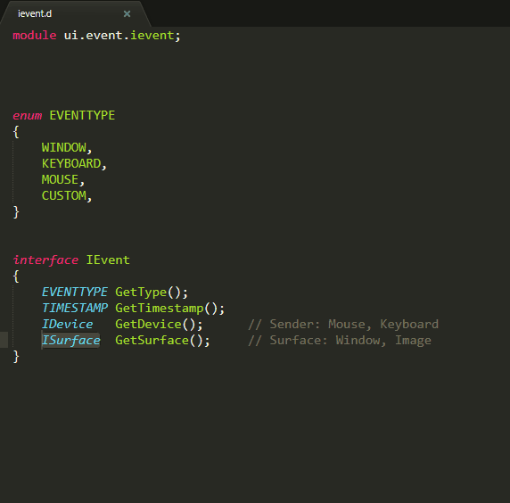

# Sublime 3 Dlang Auto-Import

Sublime 3 D AutoImport plugin. Add "import ...." for symbol.
It provides the `dlang_auto_import` command.

## Demo



## Features

In code like this:


    class Uno : IStylable
    {
        //
    }


will be auto added "import ui.istylable : IStylable;" at begin of file. Like this:


    import ui.istylable : IStylable;

    class Uno : IStylable
    {
        //
    }


## Algo
- Scan project files, using ST3 index
- Grep for Symbol
- Grep file for "module ..."
- Get module.name
- Check for existing "module ... : Symbol"
- Build line "import module_name : Symbol;"
- Insert in text. 
- - after last "import ..."
- - after "module ..."
- - at top

## Installation

Install [DlangAutoImport](https://packagecontrol.io/packages/DlangAutoImport) from Package Control.

Then add a keybinding of your choice for the `dlang_auto_import` command, by adding a line like this to your keybindings file:

```json
{ "keys": ["ctrl+shift+a"], "command": "dlang_auto_import" },
```

You can also try it out immediately by choosing "D: import ..." from the context menu or command pallete.

