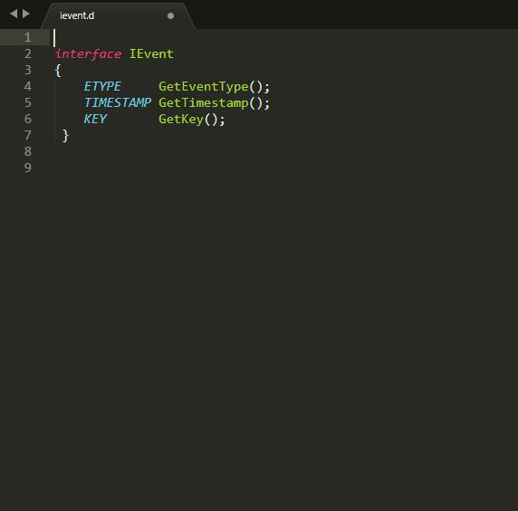

# Sublime 3 Dlang Auto-Import

Sublime 3 D AutoImport plugin. Add "import ...." for symbol.
It provides the `dlang_auto_import` command.

## Demo



## Features

In code like this:


    class Uno : IStylable
    {
        //
    }


will be auto added "import ui.istylable : IStylable;" at begin of file. Like this:


    import ui.istylable : IStylable;

    class Uno : IStylable
    {
        //
    }


## Algo
- Scan project files, using ST3 index
- Grep for "\<Symbol\>"
- Get founded file for "module <module.path.name>". Get "<module.path.name>"
- Then build line "import \<module.path.name\> : \<Symbol\>;". Inserted in text. At top. After line "module ..." if it exist, else just at top.
- Check for "module ... : \<Symbol\>" before insert.

## Installation

Install [DlangAutoImport](https://packagecontrol.io/packages/DlangAutoImport) from Package Control.

Then add a keybinding of your choice for the `lang_auto_import` command, by adding a line like this to your keybindings file:

```json
{ "keys": ["ctrl+shift+a"], "command": "dlang_auto_import" },
```

You can also try it out immediately by choosing "Dlang: auto-import" from the context menu or command pallete.

